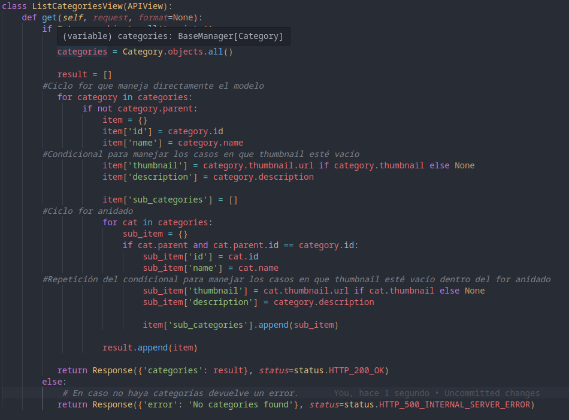
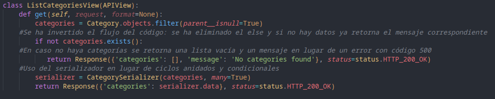
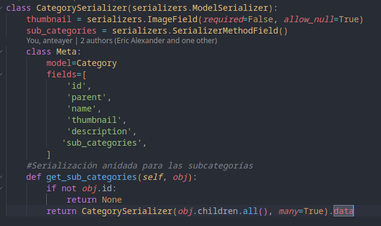

# Resumen de alteraciones:

### Alteraciones de Configuraciones:

- Actualización del archivo "requirements.txt" para que se instale correctamente las dependencias necesarias.
- Creación y configuración del archivo .env y .env_exemple
- Modificación de algunas configuraciones del archivo settings.py (en la carpeta "core") en consecuencia de la creación del archivo .env

### Alteraciones relacionadas con la actualización que se ha pedido:

#### Añadiendo "description" en "category":

- Modificación de los archivos "models.py", "serializers.py", "views.py" localizados en la ruta "/apps/category/" para ampliar el modelo "category" con un campo adicional llamado "description" y un endpoint para permitir la creación de nuevas categorías.
- Modificación del archivo url.py en "/apps/category/" para añadir la ruta POST del nuevo endpoint.

#### Refactorización de rutas:

- Refactorización en las rutas de categorias para simplificar y eliminar redundancias. Se ha normalizado las rutas para listar recursos, tal como explicado a continuación:
  - La ruta para listar categorías fue simplificada de /category/categories a /category/, alineándola con el diseño de la ruta para listar los posts del blog (/blog/).

#### Optmización de código:

- Refactorización del código del endpoint para listar las categorias.
**Inconvenientes del código original**:
  - Accede directamente al modelo en lugar de usar el serializador.
  - Iteraciones anidadas.
  - Condicionales para gestionar los caso en que el campo thumbnail estuviera vacío.
  - Poco flexible y dificultad para escalar (no permite tener más de un nivel de subcategorías; dificultad adicional para añadir nuevos campos al modelo).
  - Retorna un error en el caso no exsitan categorías creadas (que no exista categorías no es un error, debería devolver una lista vacía y eventualmente un mensaje, pero con código 200. Además, si "categories not found" se considerara un error, el código más adecuado sería el 404 y no el 500).

Se ha modificado el código del endpoint y consecuentemente, del serializador, para:

- Tener un código más limpio y que permitiera mayor escalabilidad y flexibilidad.
- Hacer uso del seralizador.
- Eliminar iteraciones anidadas y condicionales.
- Retornar el código adecuado en lugar de un error 500 en el caso no hubieran categorías creadas (además, me pareció mejor invertir el flujo del código y eliminar el "else").

## Historial detallado de modificaciones:

### 15/12/2024

- Se ha actualizado el archivo "/apps/category/moldels.py" añadiendo el campo "description".
- En dicho archivo, se ha configurado "description" como "TextField" con "blank=True" y "null=True" para que pueda ser un campo sin limite de longitud y para que se pueda dejarlo vacío.

- Se ha actualizado el archivo "/apps/category/serializers.py" añadiendo "description" a los "fields" para que se pueda serializar correctamente.

- Se ha creado el archivo /core/.env
- Se ha modificado el archivo /core/settings.py . Aunque no se ha requerido de forma explicita y directa, me ha parecido importante organizar y ocultar ciertos datos utilizando variables de entorno. Considero que esta modificación facilita la configuración del proyecto, haciéndola más dinámica y segura. Consecuentemente, se ha actualizado el archivo .env.

- Se ha creado un archivo /core/.env.exemple con los campos actualmente presentes en el archivo .env

- Se ha modificado el endpoint (presente en /apps/category/views.py) que retorna todas las categorías registrada para que también retorne el campo "description" añadido en el modelo "category".
- El archivo "/apps/category/urls.py" tenía la linea 7 configurada como "path('categories', ListCategoriesView.as_view()),"
  Inicialmente llegué a pensar que fuera un error, dado que estaba intentando acceder a las categorias con una ruta similar a la definida para los posts del blog ("/api/blog/"). Aunque después me di cuenta que no era un error, igualmente me pareció más limpio y coherente modificar ese archivo para que las rutas sean similares ("/api/blog/" devuelve los posts y "/api/category/" devuelve las categorias).

- Elaborando la lógica para el endpoint para crear nuevas categorias me di cuenta que el endpoint que ya estaba desarrollado no usaba para nada el serializador y podía optimizarse mucho cambiándole la lógica en ese sentido.
  Además, ahora será posible, a principio, cambiar como se desee los campos del modelo "category" sin que se haga necesario cambiar la lógica del endpoint, dado que, haciendo uso del serializador, los datos ya se mostrarán de forma dinámica.

- Me di cuenta que hubo un problema al hacer esa modificación. No aparecían las sub categorias. Tuve que modificar el serializador y me costó un poco dar con la solución.

- El campo "thumbnail" de "Category" es required. Para que acepte crear una categoria únicamente con los campos "name" y "description" tuve que poner "null=True" en "thumbail".

- Realizado el endpoint que crea una nueva categoria con los campos "name" y "description" pero...

- Hay problemas con el codigo del serializador de las category. Con lo cual, o bien tendré que sacrificar las sub_categories o bien retornar el código que estaba anteriormente en views, que hacía una doble iteración en lugar de usar el serializador.

- Opto por no dejar el código original (el que hace doble iteración en las categorias) y dejar el mío que trabaja directamente en el serializador. Queda pendiente de solucionar el tema de las subcategorias.

### 19/12/2024

- Resuelto los problemas con las sub_categories. Habían algunos detalles:

  - Había que añadir "parent" en el serializador.
  - Habia que cambiar la vista para filtrar los resultados con "parent: null" para no duplicar las subcategorias en las categorias.
  - Obviamente había que añadir "parent" en el JSON para añadir una nueva subcategoria.

- Mejora del código: si la consulta (get) retornaba una lista vacía, retornaba un error 500. Sin embargo, que no haya datos no me parece un error (simplemente no hay datos) y menos del tipo 500 (sería más bien un 404).
  Cambié ese comportamento del codigo para que retornara un estado 200 con una lista vacía y un mensage de que no se han encontrado categorias.
  Además, cambié el flujo del código, invertiendo el orden de las condiciones, lo que me permitió eliminar el "else" del if.

### 21/12/2024

- Borrado algunos comentarios.
- Borrado imports desnecesarios en /apps/category/views.py
- Creada una colección de Postman para poder probar los endpoints de categories.
- Pruebas finales y actualización de este mismo archivo (README.md).

## instrucciones de configuración (que ya estaban)

Psycopg2 para Mac y Linux:
sudo apt install python3-dev libpq-dev

Cuando se instalan los requerimientos si usa python 3.10 da un error y hay que poner en requirements.txt quitar "backports.zoneinfo==0.2.1" y poner : " backports.zoneinfo==0.2.1;python_version<"3.9" " porque da un error con la version mas actual.
